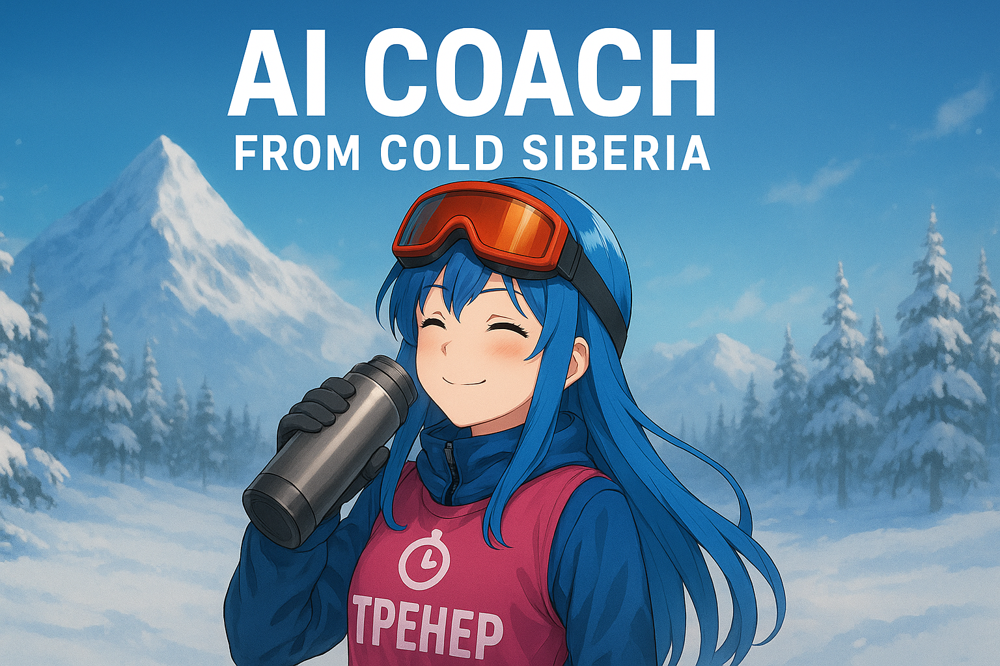

# AI Running Coach 🏃‍♂️

Strict AI coach for running, cross-country skiing, and triathlon. Built with Kotlin/Ktor and Claude AI.

<p align="center">
    
</p>

## Quick Deploy

### 1. Build (on your PC)

```bash
git clone <repo-url> && cd AIChallangeParty
./deploy-local.sh
```

### 2. Upload to VPS

```bash
scp ai-running-coach.tar.gz root@vps:~/ai-coach/
scp docker-compose.yml root@vps:~/ai-coach/
scp .env.example root@vps:~/ai-coach/.env
```

### 3. Deploy (on VPS)

```bash
cd ~/ai-coach
nano .env  # Add ANTHROPIC_API_KEY and optionally GITHUB_TOKEN

gunzip -c ai-running-coach.tar.gz | docker load
docker compose up -d
```

### 4. Configure Caddy

```caddy
your-domain.com {
    reverse_proxy localhost:8080
}
```

```bash
sudo systemctl reload caddy
```

## Configuration

**Required**: `ANTHROPIC_API_KEY` environment variable ([Get API key](https://console.anthropic.com/))

**Optional**: `GITHUB_TOKEN` environment variable for MCP Agent GitHub
integration ([Get Classic Personal Access Token](https://github.com/settings/tokens))

- Required scopes: `repo` (for private repository access)
- Required scopes: `public_repo` (for public repository access)

## Troubleshooting

```bash
# View logs
docker-compose logs -f

# Restart container
docker-compose restart

# Check health
curl http://localhost:8080/health
```

---

**Tech Stack**: Kotlin + Ktor + Claude AI (Haiku 4.5) | **Port**: 8080 | **License**: MIT
